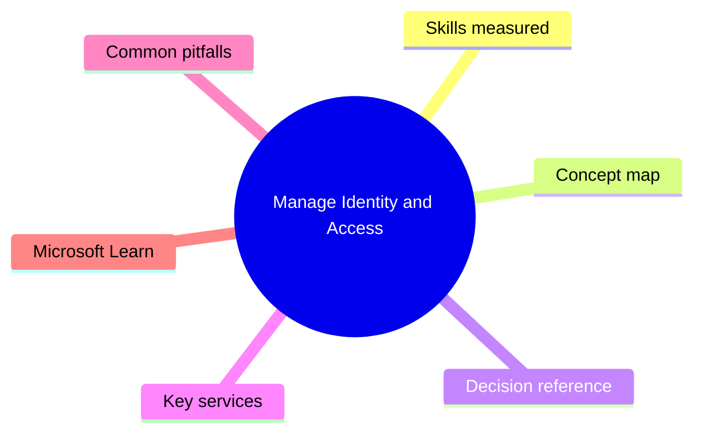
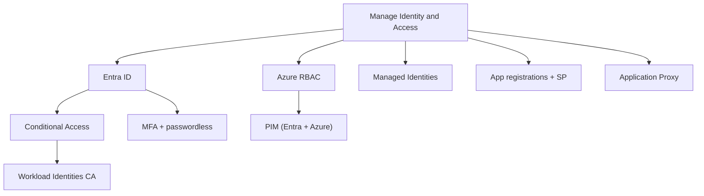

# Manage Identity and Access

> Domain 1 of AZ-500. Weight: 27%.

## Domain mind map

## Skills measured

- Manage Microsoft Entra ID identities (users, groups, devices, AUs, external users)
- Manage Entra authentication (MFA, passwordless, CA, Identity Protection)
- Manage Entra authorization (RBAC, custom roles, PIM, Workload Identities)
- Manage application access (registrations, MIs, OAuth, App Proxy, consent)

## Concept map

## Decision reference

| When you see... | Pick... | Why |
|---|---|---|
| Block legacy auth | CA policy targeting other clients | Single biggest CA win |
| JIT Azure subscription owner | PIM for Azure resource roles | Activate w/ MFA |
| Function reads KV without secret | System-assigned MI + Key Vault data role | Secret-less |
| Phishing-resistant admin sign-in | Auth strength = phishing-resistant | WHfB / FIDO2 / cert |
| Apply CA to a service principal | Workload Identities P2 + CA on workload | SP-targeted |
| On-prem app -> cloud SSO | App Proxy | No VPN |

## Key services

- **Entra ID P1/P2** - Required for CA, IP, PIM, governance
- **Azure RBAC** - Resource-scoped role assignments
- **PIM** - JIT activation + access reviews
- **Managed Identities** - Secret-less Azure auth
- **Workload Identities P2** - CA + IP for SPs
- **Application Proxy** - Reverse proxy for on-prem apps

## Common pitfalls

- Granting Owner instead of Contributor + specific Data role
- Forgetting break-glass exclusion in CA
- Using user-assigned MI when system-assigned would suffice
- Granting tenant-wide admin consent for narrowly-scoped apps

## Microsoft Learn

- [Manage identity and access](https://learn.microsoft.com/training/paths/manage-identity-access/)
- [Azure RBAC](https://learn.microsoft.com/azure/role-based-access-control/overview)

---

[<- Master Index](00-MASTER-INDEX.md) | [Master Index](00-MASTER-INDEX.md) | [Secure Networking ->](02-secure-networking.md)
