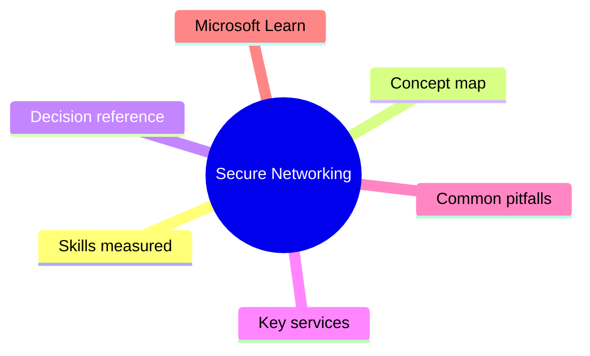
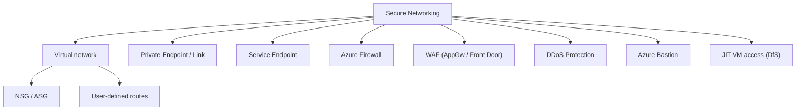

# Secure Networking

> Domain 2 of AZ-500. Weight: 22%.

## Domain mind map

## Skills measured

- Plan and implement security for virtual networks (NSGs, ASGs, route tables)
- Plan and implement security for private access to Azure resources (Private Link, Private Endpoint, Service Endpoint)
- Plan and implement security for public access (Azure Firewall, WAF on App Gateway/Front Door, DDoS Protection)
- Configure Azure Bastion, just-in-time VM access (Defender for Servers), peering, hybrid (ER/VPN)

## Concept map

## Decision reference

| When you see... | Pick... | Why |
|---|---|---|
| Lock PaaS to VNet only | Private Endpoint + disable public network access | PE preferred over SE |
| Inspect outbound to internet | Azure Firewall + force-tunnel via UDR | Egress filtering |
| L7 web protection | WAF on App Gateway (regional) or Front Door (global) | OWASP ruleset |
| Need DDoS L3/L4 + L7 | DDoS Protection (network) + WAF | Layered defense |
| RDP without public IP | Azure Bastion | Browser-based, no public IP |
| Open RDP only when needed | JIT VM access (Defender for Servers) | Time-bounded NSG rule |

## Key services

- **NSG/ASG** - L3/L4 ACLs
- **Private Endpoint / Private Link** - PaaS via private IP
- **Azure Firewall (Std/Prem)** - Stateful FWaaS, Premium adds TLS inspect + IDPS
- **WAF** - L7 web protection (AppGw/Front Door)
- **DDoS Protection** - Network/IP plans
- **Bastion (Std/Prem)** - Hardened RDP/SSH jump box
- **Defender for Servers** - JIT, FIM, vuln assessment

## Common pitfalls

- Private Endpoint requires DNS resolution (Private DNS Zone or custom DNS)
- Azure Firewall Premium TLS inspect needs intermediate cert in KV + MI
- WAF prevention mode without tuning can block legit traffic - run Detection first
- Using Service Endpoints when Private Endpoints are now the recommended pattern
- Forgetting Bastion needs a /26 'AzureBastionSubnet'

## Microsoft Learn

- [Secure networking](https://learn.microsoft.com/training/paths/manage-securing-networking/)
- [Private Link](https://learn.microsoft.com/azure/private-link/)
- [Azure Firewall](https://learn.microsoft.com/azure/firewall/overview)

---

[<- Manage Identity and Access](01-identity-access.md) | [Master Index](00-MASTER-INDEX.md) | [Secure Compute, Storage, and Databases ->](03-secure-compute-storage.md)
