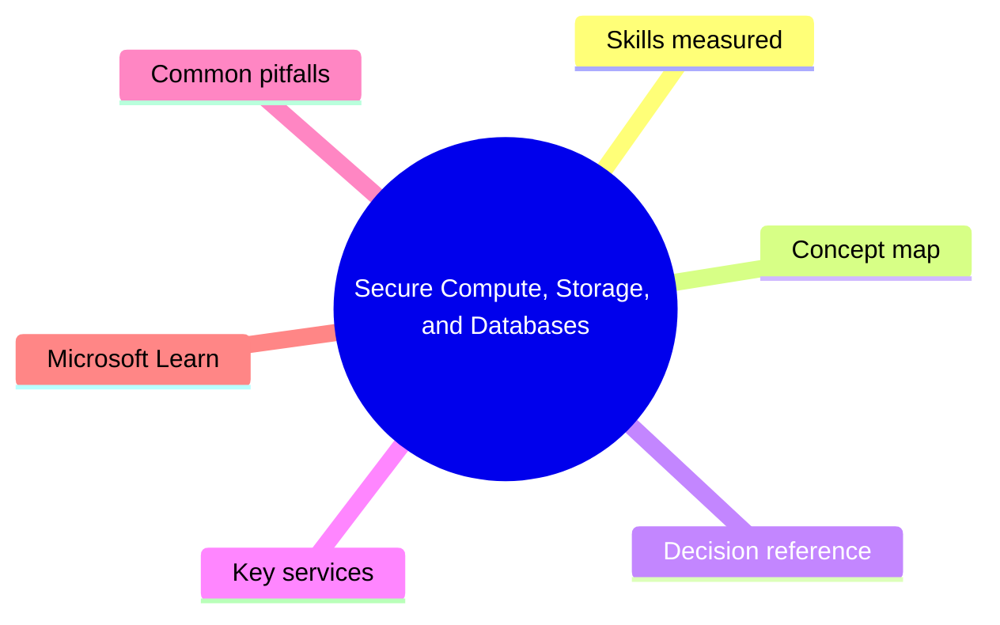
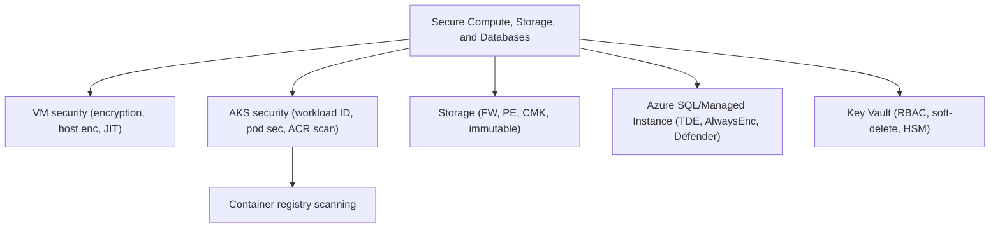

# Secure Compute, Storage, and Databases

> Domain 3 of AZ-500. Weight: 23%.

## Domain mind map

## Skills measured

- Plan and implement advanced security for compute (VM disk encryption, host encryption, AKS pod identity, ACR scanning, Defender for Containers)
- Plan and implement security for storage (firewall, PE, immutable, encryption with CMK, SAS/Entra)
- Plan and implement security for Azure SQL Database / Managed Instance (auth, TDE with CMK, Always Encrypted, audit, Defender for SQL)
- Plan and implement security for Key Vault (RBAC vs access policy, soft delete, purge protection, HSM)

## Concept map

## Decision reference

| When you see... | Pick... | Why |
|---|---|---|
| Encrypt VM with customer-managed key | Azure Disk Encryption + CMK in KV (or DES with CMK) | Encryption-at-host adds another layer |
| Encrypt SQL with own key | TDE with customer-managed key in KV | Bring your own key |
| Make storage immutable for compliance | Container with time-based retention policy + WORM | Cannot be modified |
| KV authorization | Use Azure RBAC (preferred) over legacy access policies | Role-based |
| Hardware-backed key | Key Vault Managed HSM (or Premium tier KV) | FIPS 140-2 L3 |
| Container vuln scanning | Defender for Containers (image scan in ACR + runtime) | Continuous scanning |

## Key services

- **Azure Disk Encryption** - OS+data disk via BitLocker/DM-Crypt + KV-held key
- **Encryption at host** - Hypervisor-level data-disk encryption
- **Defender for Containers** - Image scan + runtime protection + cluster posture
- **Storage CMK** - Encryption with customer key from KV
- **Always Encrypted** - Client-side encryption for SQL
- **KV Managed HSM** - Single-tenant FIPS 140-2 L3 HSM

## Common pitfalls

- Forgetting to enable purge protection on KV (CMKs become unrecoverable risk)
- Confusing TDE with CMK vs Always Encrypted (server-side vs client-side)
- Mixing KV access policies and RBAC on the same vault
- Setting storage firewall too tight without service exception (locking out trusted Azure services)

## Microsoft Learn

- [Manage security operations](https://learn.microsoft.com/training/paths/manage-security-operation/)
- [Defender for Cloud](https://learn.microsoft.com/azure/defender-for-cloud/)

---

[<- Secure Networking](02-secure-networking.md) | [Master Index](00-MASTER-INDEX.md) | [Manage Security Operations ->](04-security-operations.md)
