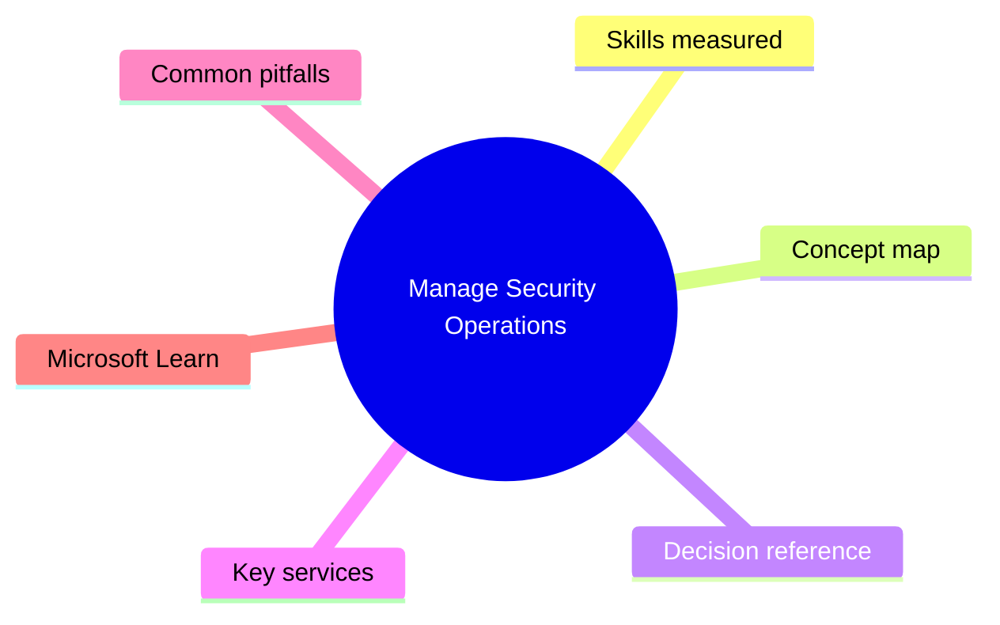
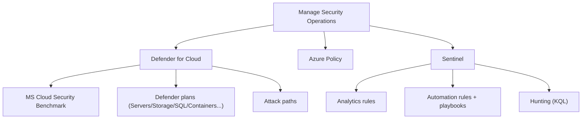

# Manage Security Operations

> Domain 4 of AZ-500. Weight: 28%.

## Domain mind map

## Skills measured

- Plan, implement, and manage governance with Azure Policy + Microsoft Defender for Cloud (MCSB, custom standards)
- Manage security posture with Defender for Cloud (Secure Score, recommendations, attack paths)
- Configure and manage threat protection (Defender plans for Servers, Storage, SQL, Containers, App Service, Key Vault, etc.)
- Configure and manage Microsoft Sentinel (workspace, connectors, analytics, automation, hunting)

## Concept map

## Decision reference

| When you see... | Pick... | Why |
|---|---|---|
| Establish baseline posture | Apply MCSB initiative via Azure Policy / DfC | Free tier |
| Detect Linux SSH brute force | Defender for Servers Plan 2 | Sysmon + behavioral |
| Anonymous blob upload protection | Defender for Storage (malware scan) | On-upload scanning |
| Centralize alerts in SIEM | Sentinel + Azure Activity / Defender XDR connectors | Single pane |
| Auto-isolate compromised VM | DfC workflow automation -> Logic App -> NSG deny + tag | SOAR |
| Visualize blast radius of misconfig | Defender for Cloud Attack Path Analysis | Graph of risks |

## Key services

- **Microsoft Defender for Cloud (MDC)** - CSPM + CWP for Azure/AWS/GCP
- **Microsoft Cloud Security Benchmark** - Built-in security baseline
- **Defender plans** - Servers, Storage, SQL, Containers, App Service, KV, Resource Manager, DNS, AI
- **Microsoft Sentinel** - SIEM/SOAR with KQL
- **Azure Policy** - Compliance enforcement engine

## Common pitfalls

- Enabling all Defender plans without cost forecasting
- Confusing CSPM (foundational - free) with Defender CSPM (paid - attack paths, agentless scan)
- Building Sentinel rules without entity mapping (no incident enrichment)
- Ignoring 'attack paths' which surface highest-risk multi-step issues

## Microsoft Learn

- [Manage security operations](https://learn.microsoft.com/training/paths/manage-security-operation/)
- [Defender for Cloud](https://learn.microsoft.com/azure/defender-for-cloud/)
- [Sentinel](https://learn.microsoft.com/azure/sentinel/)

---

[<- Secure Compute, Storage, and Databases](03-secure-compute-storage.md) | [Master Index](00-MASTER-INDEX.md) | [Cheatsheet ->](05-exam-cheatsheet.md)
