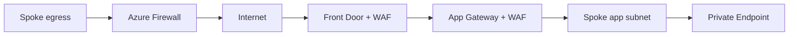
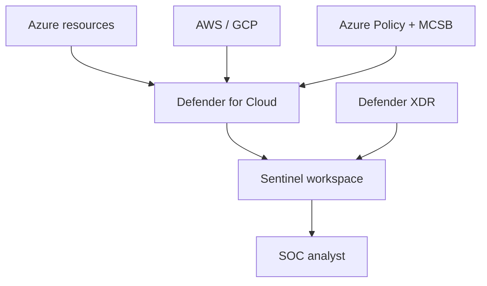

# Architectures - AZ-500

> Reference architectures you should be able to draw on a whiteboard for the exam.

## Hub-and-spoke with Azure Firewall + WAF

## DfC + Sentinel layered

---

[Master Index](00-MASTER-INDEX.md)
